<h1>Multiple Brand Login Experiences with a Single Okta Org</h1>

<h3>Authors: Mark Milchuk, Sami Abdul</h3>
<h2><a href="https://www.youtube.com/watch?v=HEhNVEhX6WE&t=1702s">Oktane18 Presentation on YouTube: Managing Multiple Brand Experiences with a Single Okta Org</a>
</h2>

<h3>Table of Contents</h3>

<ul>
<li><a href="#sec-1">A. Introduction</a></li>
<li><a href="#sec-2">B. Prerequisites</a></li>
<li><a href="#sec-3">C. Build MVC Web Applications</a></li>
<li><a href="#sec-4">D. Setting up Okta's Preview Sandbox</a></li>
<li><a href="#sec-5">E. Configure, Deploy and Run Web Applications</a></li>
</ul>

# A. Introduction
In multi-brand companies, there is often need to have **multiple brand experiences for all applications** . A different theme is required for each brand. For Example: A blue theme for Blue Brand and a green theme for Green Brand. Dynamic branding is ideal for multi-brand companies. You can create a single login page that determines which brand appears at run time. All brands are served from the same login page and integrated with single Identity Provider.

When you are designing the authentication experience for brand applications in your organization, you have to choose whether the user authentication flow will use **Universal/Central (More secured way of user authentication)** or **Application specific Embedded Login page (Less secured way of user authentication)**. Universal Login page provided by Identity provider is always a more secured way of user authentication. In case of a Universal Login page, when the users try to log in they are redirected to a central Login page hosted by Identity Provider, through which authentication is performed, and then they are redirected back to the protected application (e.g. Google Apps or Microsoft Office365 Apps). Each custom sign-in page is hosted on a custom domain URL e.g. login.<brand>.com.

In our scenario, **Franchise Org Corporation** has a single user base to handle its two brands (could be "n" brands), **Blue brand** and **Green brand**. The corporation uses dynamic branding to customize the applications (including login experience) for each brand. When users click login link on each protected application, he/she will be presented with a login page based on the brand indicated in the login URL (dynamic branding). Login page is hosted on central location. User is authenticated against a single Identity Provider and redirected back to protected brand application after user authentication. Sign-in and Sign-out experiences are implemented via standardized sign-in protocols.

If you are designing a solution for a multi-brand company then the solution provided in this GitHub repository is applicable to you. This solution applies if you have selected **Okta as an Identity Management System (Identity Provider)** for your organization.
 
## Summary of Requirements:
Here is summary of requirements for a multi-brand company login page:

1. Universal Login page hosted at central location (not provided by each application)
2. Multiple Brand Experiences with a Single Okta Org. Each brand could have different style for Login page e.g. Green Brand style and Blue Brand style.
3. Applications interact with Identity Management System through Standardized Sign-In Protocols such as OpenID Connect, OAuth 2.0 and SAML 2.0
4. Single Sign On (SSO)  is required between protected brand applications.

## Authentication Experiences/Solutions Provided by Okta:
### Solution 1. Customize Okta's Universal Login page for your Org
* Issues with this solution: 
	* Currently, there are limited customization options available for default Okta login page i.e. <a href="#">https://orgdomain.okta.com/login/default</a>  
	* Cannot have multiple brand login experiences for application. This solution is not applicable to your organization if you want have multiple brand experiences for a single Okta Org. 
	
### Solution 2. Each application creates its own Login page using <a href="https://developer.okta.com/code/javascript/okta_sign-in_widget" target="_blank">Okta Sign-In Widget</a>.
* Issues with this solution: 
	* Embedded application login page is always less secure
	* Does not follow standardized Sign-In protocols such as OpenID Connect, OAuth 2.0 and SAML 2.0
	* Each application will have to create its own login page (more work and less consistent)
	* Application developeres can easily access/store user's credentials from javascript widget (less secure) 
### Solution 3. Each application creates its own Login page via <a href="https://developer.okta.com/docs/api/resources/authn" target="_blank">Okta's Authentication API</a>
* Issues with this solution: 
	* Embedded login page is always less secured way of user authentication
	* Does not follow standardized Sign-In protocols such as OpenID Connect, OAuth 2.0 and SAML 2.0
	* Each application will have to create its own login page (more work and less consistent)
	* Each application will have to create other related flows using Okta Authentication API e.g. Reset Password, Forgot Password, etc.
	* Application developeres can easily access/store user's credentials from Login page (less secure)
	* Single Sign-on is not possible for brand applications. 

## Features of Multiple Brand Login Page Solution Provided in this Repository
1. **Multiple Branded Login Experiences with a Single Okta Org**: Login page supports multiple brands for a single okta org. For Example: Green brand and Blue brand.
2. **Dynamic Branding for Multiple Brands**: Dynamic branding is very useful for multi-brand companies. You can create a single login page that determines which brand appears at run time. All brands are served from the same login page that uses single Okta org. We will create separate style sheet for each brand e.g. Blue Style and Green Style
3. **Customizable Login Page**: Fully customizable Login page. For each brand, you can customize based on brand theme using brand style sheet and by using Okta Sign-In widget.  
4. **Responsive Login Page Design**: Login Page is also built with “Responsive Design”, so Login Page renders well on a variety of devices and screen sizes. Responsive design allows Login page to adapt to the device users are viewing it on.
5. **Applications interface with Login Page using Standardized Sign-In Protocols**: Login Page work with the following standardized Sign In protocols: OpenID Connect, OAuth 2.0 and SAML 2.0. By using standardized sign in protocols Applications are loosely coupled with the Identity Management System. Standard Sign-In protocols also issue security tokens (JWT and SAML2.0) that allow the application to call protected APIs. REST APIs are protected with OAuth2.0 and require JWT tokens to be passed.
6. **Single Sign-On**: Applications issue “passive” authentication requests to the Login Page/Identity Management System using URL redirection (HTTP 302). After authentication by the user a session cookie is set in the user’s browser cookie cache. This enables one of the most important features of the Identity Management System, the ability of the user to “Single Sign-On” between different applications in the same Identity Realm. Users only need to enter their credentials once when moving from one application to another.
7. **Universal Login Page (more secured)** – Multiple Brand Universal Login Page is hosted on central location to keep your attack surface as small as possible and minimize the risk to the users and applications in the Identity Realm. Developers who create the Login Page are trained and specialize in a particular Identity Management System and are trusted. Application developers who either by malicious intent or ignorance of the identity management system do not have that ability, they put user identities/credentials and the applications/data at risk.
8. **Simpler Maintainability**: Universal Login page is easy to maintain. Login Page is built using **Okta Sign-In widget** and contains all features provided by Okta e.g. Forgot Password, Unlock Account, Help, **Multi-Factor Authentication**. If new features are added by the Identity Management System provider then they are immediately incorporated and available in the Login Page. 
9. **Provides a consistent user experience for each brand**: Multi-brand Login Page always appears exactly the same and at the same URL regardless of the application the user is authenticating for each brand. User always knows which set of credentials to enter because it’s the same Brand Login Page.

[<a href="#top">Back to Top</a>]

# B. Prerequisites

Before you get started, you'll need to install or set up the
software and services below:

1.  Download and install [Visual Studio Community Edition](https://www.visualstudio.com/downloads/)     
    At this time, Visual Studio 2017 is the most recent version of Visual Studio available.

    
	 

2.  Sign up for [Okta Developer Edition](http://developer.okta.com/).    
    You'll need an Okta *organization* of your own to use as you follow this guide. After activating your account, log in to it. If you just created an account, you'll see a screen similar to the one below. Click on **< > Developer Console** in the top-left corner and switch to the Classic UI.
    
    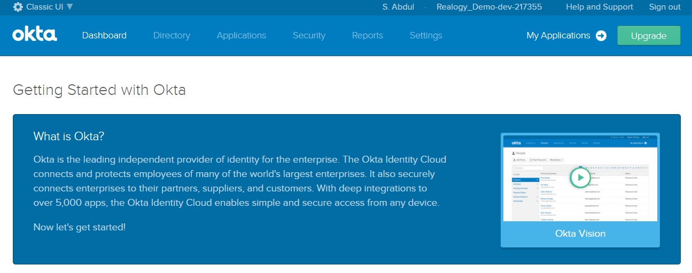 
	 

3.  *Optional:* Sign up for a [free trial of Microsoft Azure](http://azure.microsoft.com/en-us/pricing/free-trial/).
    
    This step is not required. You can run sample applications from your computer. However, if you want to host Branded Login pages and Web applications on a public-facing Website then Azure is the easiest place to do that. You can map custom Domain Names to Azure Web application. This will be useful for hosting multi-branded login page application.

	 
	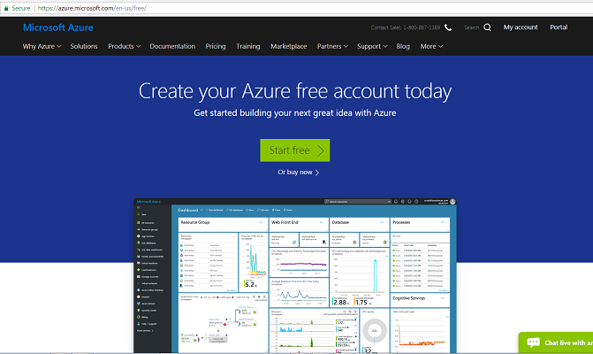 
	 
 
[<a href="#top">Back to Top</a>]
 

# C. Build MVC Web Applications

The Visual Studio solution that you have downloaded contains three projects.
Open solution file in Visual Studio. You should be able to see three projects and Build Solution.
	 
	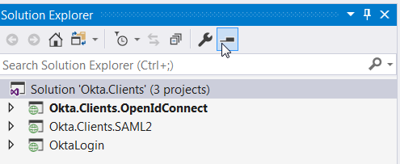 
	 

1. **Okta.Clients.OpenIdConnect**: This is a sample **OpenID Connect** MVC Web application that demonstrate the use of branded login pages for a single Okta org.
	* It is a sample server-side Web application.
	* It uses Microsoft.Owin Middleware for OpenID Connect protocol implementation.
		 
		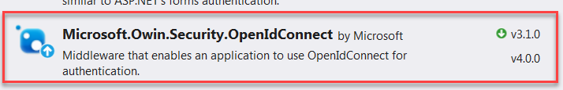 
		 
	* User is authenticated via selected branded login page 
	* Two brands are used in this sample: (a) Green Brand; and (b) Blue Brand  	
	* You can run this project locally (localhost) or publish this application on Microsoft Azure. 
		 
		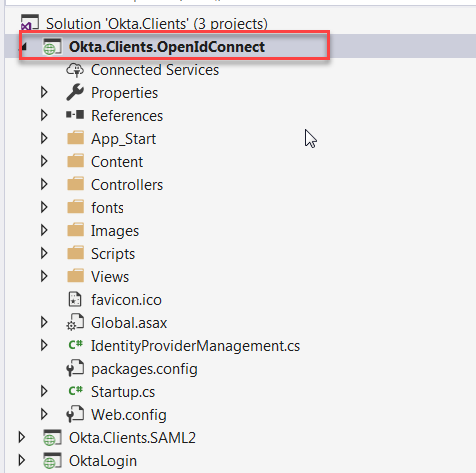 
		 
	* Set <b>Okta.Clients.OpenIdConnect</b> project as StartUp project and run application and you will see "Okta Multi-Branded Login Pages" page.
		 
		 
		 
	* <b>Note</b>: To test the complete user authentication flow via Okta org see <a href="#sec-5">Section E</a>
		 
2. **Okta.Clients.SAML2**: This is a sample **SAML 2.0** MVC Web application that demonstrate the use of branded login pages for a single Okta org.
	* It is a sample server-side Web application.
	* It uses Sustainsys.Saml2 NuGet package for SAML2 protocol implementation. 
		 
		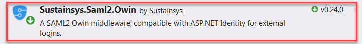 
		 
	* User is authenticated via branded login pages. 
	* Two brands are used in this sample: (a) Green Brand; and (b) Blue Brand
	* You can run this project locally (localhost) or publish this application on Microsoft Azure.
		 
		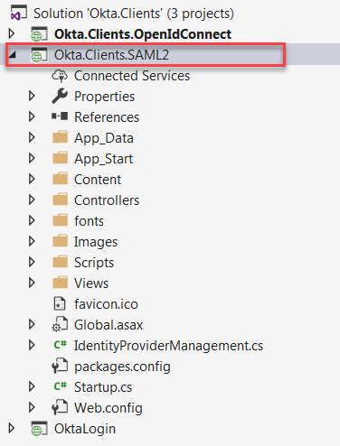 
		  
	* Set **Okta.Clients.SAML2** project as StartUp project and run application and you will see "Okta Multi-Branded Login Pages" page.	
		 
		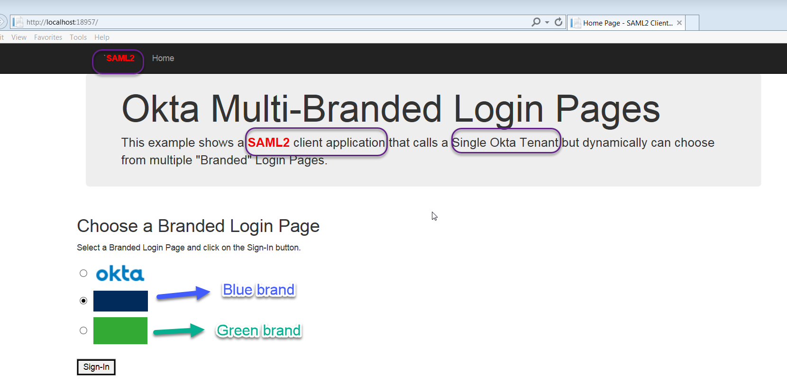	
		 
	*  <b>Note</b>: To test the complete user authentication flow via Okta org see <a href="#sec-5">Section E</a>
		 
3. **OktaLogin**: This is a MVC Web application that uses Okta Sign-in widget for user authentication.
	* It is server-side MVC Web application
	* It uses <b>Okta Sign-In Widget</b> for user authentication. The Okta Sign-In Widget is a JavaScript library that gives you a fully-featured and customizable login experience which can be used to authenticate users on any website. For details, see <a href="https://developer.okta.com/code/javascript/okta_sign-in_widget" target="_blank">Okta Sign-In Widget Guide</a>	
	* Two brands are used in this sample: (a) Green Brand; and (b) Blue Brand
	* For each brand, there is a separate style sheet: (a) Style-Blue.css; and (b) Style-Green.css 
	* It also supports multiple languages (System.Globalization)
	* You can run this project locally (localhost) or publish this application on Microsoft Azure. There are several advantages on hosting on Azure including identifying brand based on hostname. Each custom sign-in page is hosted on a custom domain URL e.g. login.<brand>.com.   
		 
		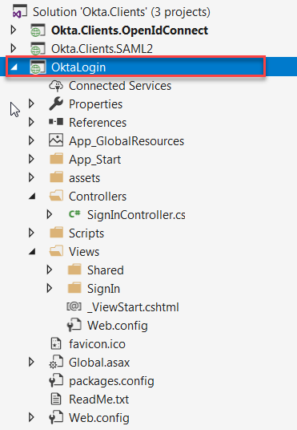 
		  
	* Set **OktaLogin** project as StartUp project and run application with below parameters and you will see "Blue Brand Login Page" page. <a href="#">http://localhost:12411/?brand=blue&RelayState=2121</a>	
		 
		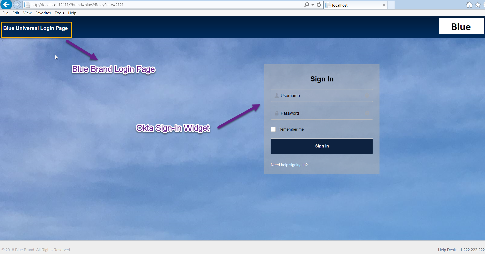 
		 
	* To see "Green Brand Login Page", run with these parameters. <a href="#">http://localhost:12411/?brand=green&RelayState=2121</a>
		 
		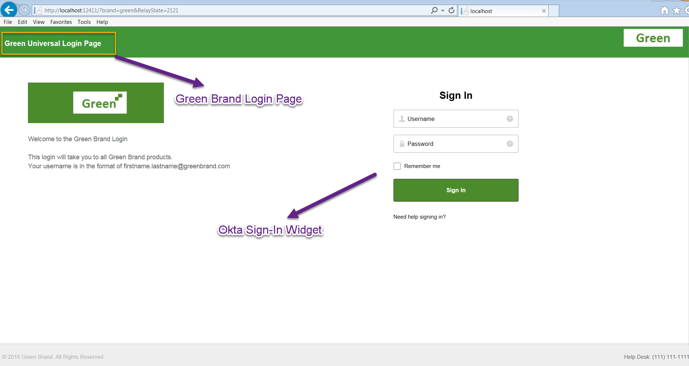 
		 
	* <b>Note</b>: To test the complete user authentication flow via Okta org see <a href="#sec-5">Section E</a>
		 
 
[<a href="#top">Back to Top</a>]
 

# D. Setting up Okta's Preview Sandbox

1. Create a Custom Authorization Server
2. Create Identity Providers for Each Branded Login Page
3. Enabling CORS (Trusted Origins)
4. Create Test User Accounts for Each Brand (Add Person)
5. Create Groups
6. Add OpenID Connect and SAML 2.0 Applications

## Step 1. Create a Custom Authorization Server ##

Okta allows you to create custom OAuth 2.0 authorization servers. Create a new custom authorization server for this application.

1. Go to **Security → API → Authorization Servers**
2. Click on **"Add authorization server"** button

	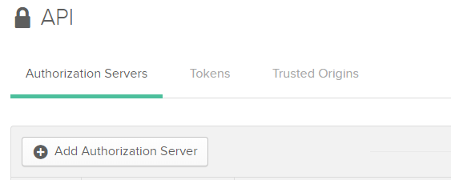

3.  Provide below information and click on Save button.

	* Name: Franchisor Org Auth
	* Audience: https://franchisor.org.com
	* Description: Authorization server for franchisor 

4.  It will add a custom authorization server.

	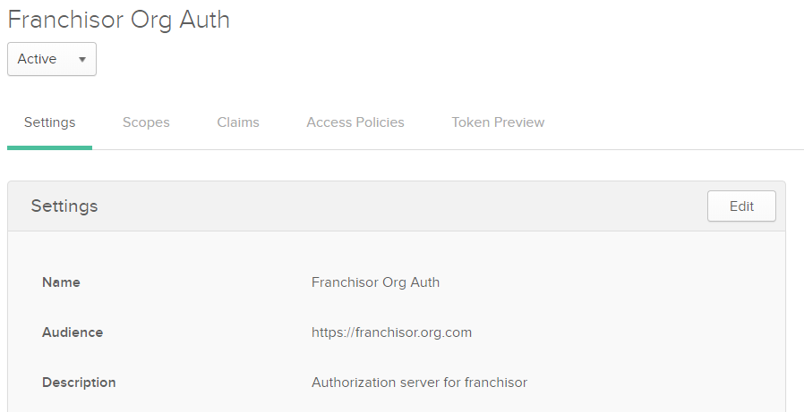

5.  Access Policies:

	By default, there is no access policies. We will add access policies for our sample application later.

## Step 2. Create Identity Providers for Each Branded Login Page ##
Okta allows you to create Identity Providers to manage federations with external Identity Providers (IdP). Each identity provider (IdP) requires some setup. For this application, we will create an Identity Provider for each branded login page.

1. Go to **Security → API → Identity Providers**
	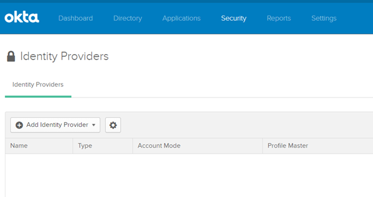

### 2.1	Create Identity Provider for "Green Brand Login Page" ###
This is for Green Brand. This will not be act as a true identity provider. This will not do traditional SAML 2.0 Request/Response (as SAML2 functionaliy is never used). Its only job is to route the authentication request to the branded login page, which contains the Sign-in widget. 
 
1. Click on **"Add Identity Provider"** button
2. Select “Add SAML 2.0 IdP”
	 
	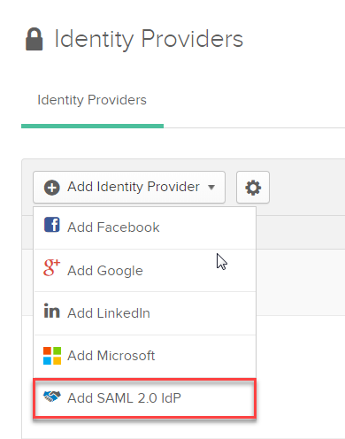
	  
3. Provide fields for new Identity Provider
	* Name: Green Brand Login Page
	* IdP Username: idpuser.subjectNameId
	* Filter: Unchecked
	* Match against: Okta Username
	* If No match is found: Redirect to Okta Sign-in Page
	* SAML Protocol Settings:
	* IdP Issuer URI: Provide URL for Green branded Login Page. 
		For Example: https://demo.login.greenbrand.com
	* **IdP Single Sign-on URI: Provide URL for Green brand Login Page URL**.
		This is the URL where login page application is hosted. Unauthenticated user will be redirected there. 
		For Example: https://demo.login.greenbrand.com
	* Request Binding: HTTP POST
	* Request Signature: Unchecked
	* Rest of the fields : Default Values
	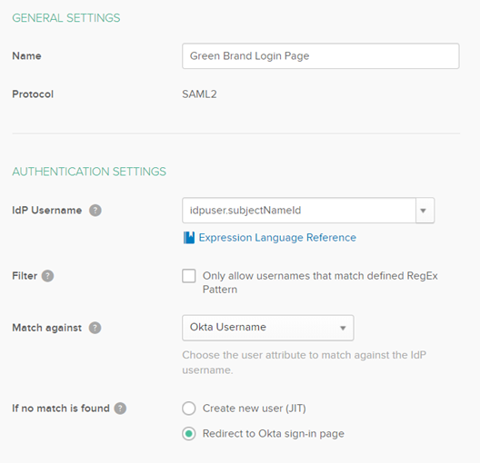
	 
	
	 
4.  It will create a new SAML 2.0 Identity Provider
	 
	
	 
	* Note: The last highlighted part of Assertion Consumer Service (ACS) URL provides **idp** value. This value be will be sent as **idp** query string parameter value in the authentication request to route to the green branded login page.

### 2.2	Create Identity Provider for "Blue Brand Login Page" ###
This is for Blue Brand. This will not be acted as true identity provider. This will not do traditional SAML 2.0 Request/Response (as SAML2 functionaliy is never used). Its only job to host login page, which contains the sign-in widget. 

1. Click on **"Add Identity Provider"** button
2. Select “Add SAML 2.0 IdP”
	
3. Provide fields for new Identity Provider
	* Name: Blue Brand Login Page
	* IdP Username: idpuser.subjectNameId
	* Filter: Unchecked
	* Match against: Okta Username
	* If No match is found: Redirect to Okta Sign-in Page
	* SAML Protocol Settings:
	* IdP Issuer URI: Provide URL for Blue branded Login Page.
		For Example: https://demo.login.bluebrand.com
	* **IdP Single Sign-on URI: Provide URL for Blue brand Login Page URL.** 
		This is the URL where login page application is hosted. Unauthenticated user will be redirected there. 
		For Example: https://demo.login.bluebrand.com
	* Request Binding: HTTP POST
	* Request Signature: Unchecked
	* Rest of the fields : Default Values
	  
	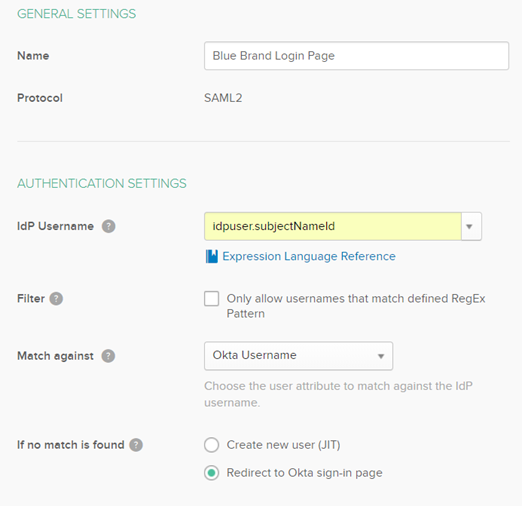
	 
	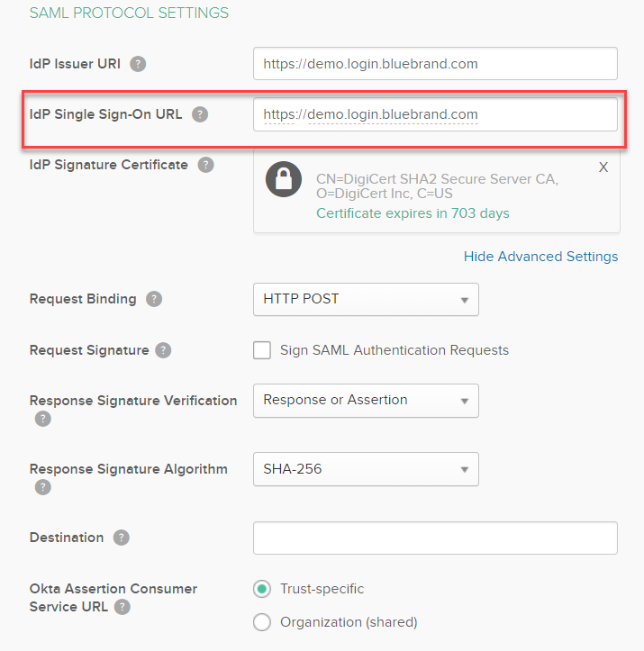
	 
4. It will create a new SAML 2.0 Identity Provider
	 
	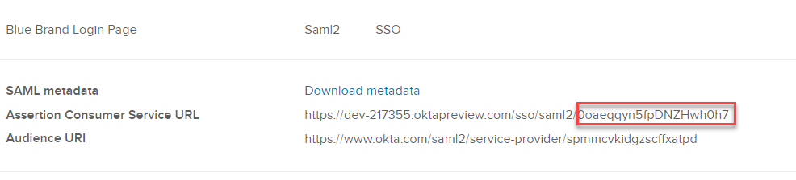
	 
	* Note: The last highlighted part of Assertion Consumer Service (ACS) URL provides **idp** value. This value be will be sent as **idp** query string parameter value in the authentication request to route to the blue branded login page.

## Step 3. Enabling CORS (Trusted Origins) ##
In Okta, CORS (Cross-Origin Resource Sharing) allows JavaScript hosted on your websites to make an XHR to the Okta API with the Okta session cookie. Every website origin must be explicitly permitted via the administrator UI for CORS. You have to enable CORS for the Branded Login pages.

**Go to Security → API → Trusted Origins**

### 3.1 Add CORS for Green Brand Login Page ###
- Click on **Add Origin**
	* Name: Green Brand Login
	* Origin URL: Provide Branded Login Page URL e.g. https://demo.login.greenbrand.com
	* Type: CORS [Checked] Redirect [Unchecked]
- Click on **Save** button
	 
	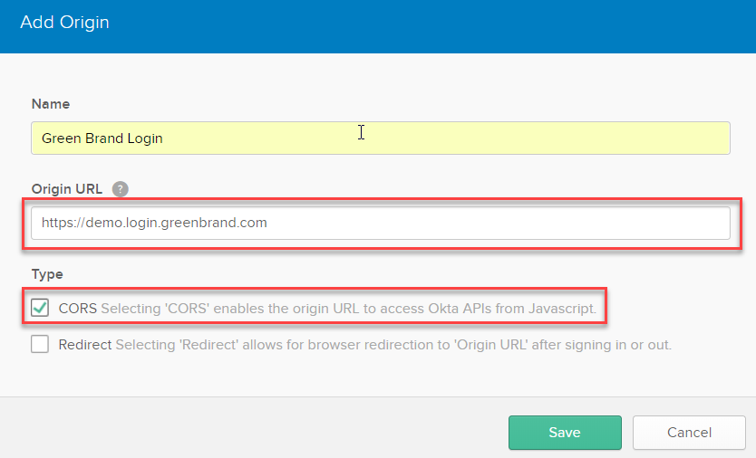
	 
### 3.2 Add CORS for Blue Brand Login Page ###
- Click on **Add Origin**
	* Name: Blue Brand Login
	* Origin URL: Provide Branded Login Page URL e.g. https://demo.login.bluebrand.com
	* Type: CORS [Checked] Redirect [Unchecked]
- Click on **Save** button
	 
	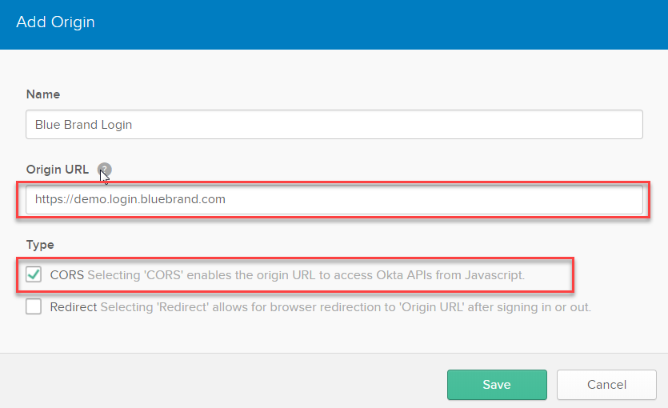
	 
- Now, you should have **two CORS** in the list of Origins
	 
	
	 	

## Step 4. Create Test User Accounts for Each Brand (Add Person) ##
Now, we will add two test accounts in Okta. Use the People page to add test users.

Go to **Directory → People**

### 4.1 Add Test User Account for Green Brand ###
Enter a test user account for Green Brand. For Example: John.Doe@greenbrand.com

- Click on **Add Person**
	* First Name: John
	* Last Name: Doe
	* Username: John.Doe@greenbrand.com
	* Primary Email: John.Doe@greenbrand.com
	* Password: set by admin
	* Password: provide value
	* [Unchecked] User must change password on first login 
	 
	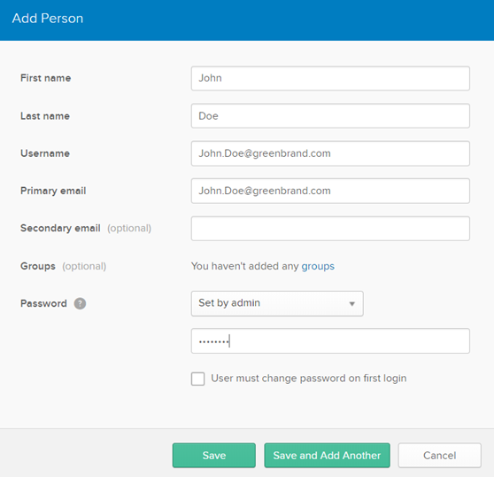
	 

### 4.2 Add Test User Account for Blue Brand ###
Enter a test user account for Green Brand. For Example: Jane.Doe@bluebrand.com

- Click on **Add Person**
	* First Name: Jane
	* Last Name: Doe
	* Username: Jane.Doe@bluebrand.com
	* Primary Email: Jane.Doe@bluebrand.com
	* Password: set by admin
	* Password: provide value
	* [Unchecked] User must change password on first login 
	 
	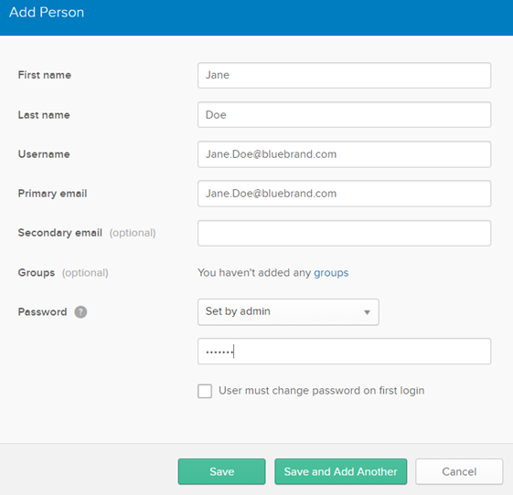
	 
	Go to Directory -> People. Now, you should see both test accounts.
	 
	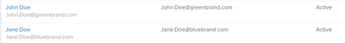
	 

## Step 5. Create Groups ##
Its easier to manage users and applications by creating groups. Now, we will create two brand groups and add test accounts to those groups. 

Go to **Directory → Groups** 

### 5.1 Add GreenBrand Group ###
Create a group for Green Brand users.

- Click on **Add Group**
	* Name: GreenBrand Group
	* Description: Users belong to Green Brand
	 
	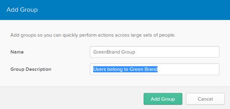
	 
- Assign John.Doe@GreenBrand.com to GreenBrand Group
	 
	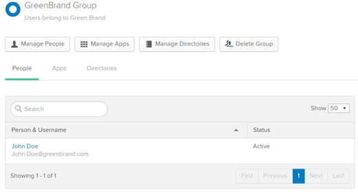
	 
 

### 5.2 Add BlueBrand Group ###
Create a group for Blue Brand users.

- Click on **Add Group**
	* Name: BlueBrand Group
	* Description: Users belong to Blue Brand
	 
	
	 
- Assign Jane.Doe@BlueBrand.com to BlueBrand Group
	 
	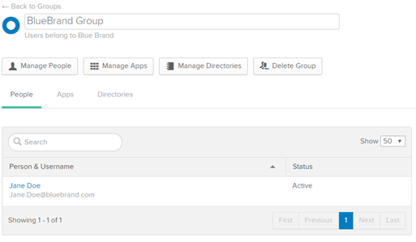
	 
- Go to Directory -> Groups, you should be able to see both groups (with one user member)
	 
	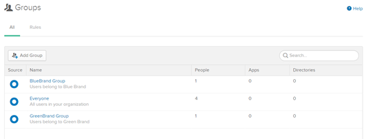
	 

## Step 6. Add OpenID Connect and SAML 2.0 Applications ##
Okta allows you to configure OpenID Connect or SAML2 Web applications. 

Go to **Applications → Applications**

### 6.1 Add OpenID Connect Branded Application ###
Lets first add OpenID connect branded Web Application.

- Click on **Add Application** button
	 
	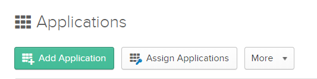
	 	
- Click on **Create New App** button
	 
	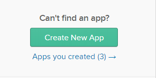
	 
- New Application Integration
	
	* Platform: Web
	* Sign on Method: OpenID Connect
	 
	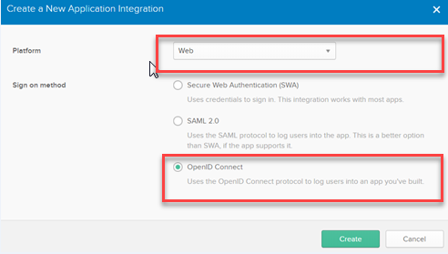
	 
- Provide OpenID Connect Application Integration details

	* Application Name: OpenID Connect WebApp
	* Application Logo: [optional]
	* Login Redirect URIs: provide Login URL for application 
		e.g. https://oktane2018openidconnect.azurewebsites.net/
	* Logout Redirect URIs: provide Logout URL for application
		e.g. https://oktane2018openidconnect.azurewebsites.net/
		 
		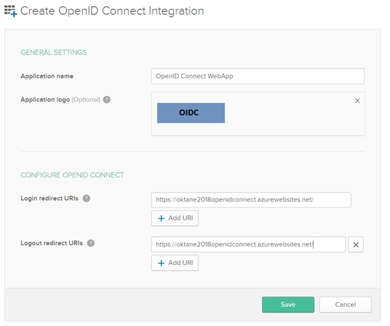
		 
- Edit Application Configuration:

	* Select Grant Types: 
		* Authorization Code
		* Implicit (Hybrid) - Allow ID Token
	* Click on **Save** button to save changes.
	* Note: Client Credentials are needed for application configuration
	 
	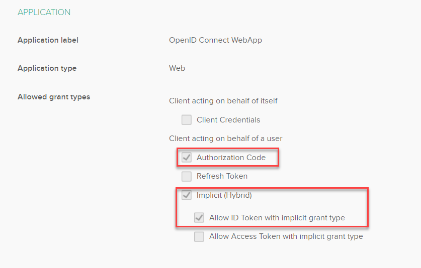
	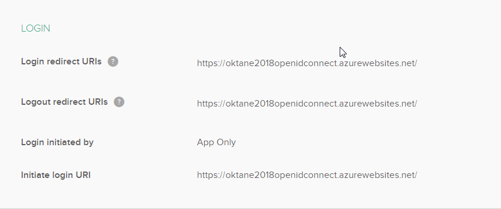
	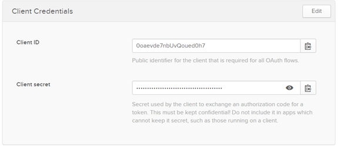
	 
- Assign application to groups:

	* BlueBrand Group
	* GreenBrand Group
	 
	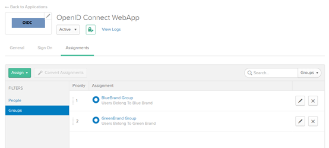
	 
- Go to Applications List. You will see newly added application.
	 
	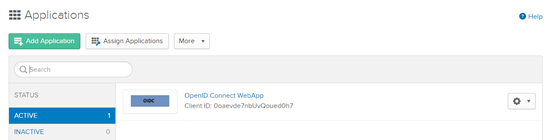
	 
- Add Access Policy for application:
	* Go to Authorization Server.
	* Go to **Security → API**
	* Select Authorization server
	 
	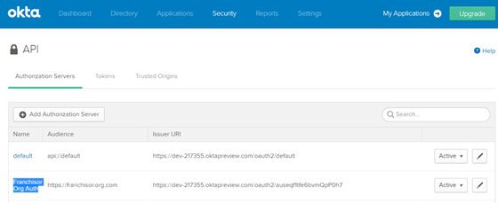
	 
- Go to Access Policies under Authorization Server
	* Add New Access Policy (if not already exists)
	* Click on **Add Policy** button.
	 
	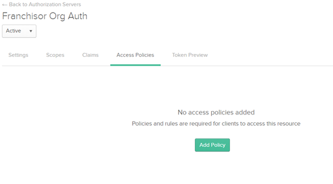
	 
- Provide information for Access Policy

	* Name: OpenID Connect WebApp Policy
	* Description: Access Policy for OpenID Connect WebApp
	* Select the **OpenID Connect Web App**
	* Click on **Create Policy** button
	 
	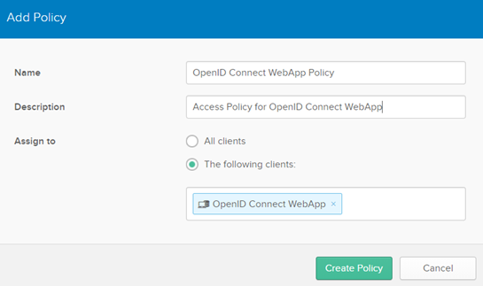
	 
- Add User Access Rule for OpenID Connect Web Application
	* Rule Name: User Access Rule
	 
	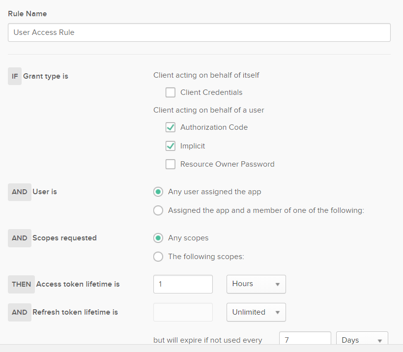
	 
- Review Access Policy for the OpenID Connect Web Application
	 
	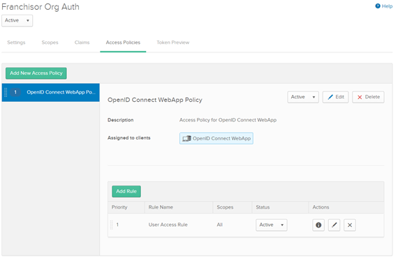
	 
### 6.2 Add OpenID Connect Client Proxy Application for SAML2 Applications ###
Now, we will configure an OpenID Connect Client Proxy Application. This will be used as proxy for redirecting user to branded login page (for all SAML applications).

- Click on **Add Application** button
	 
	
	 	
- Click on **Create New App** button
	 
	
	 
- New Application Integration
	
	* Platform: Web
	* Sign on Method: OpenID Connect
	 
	
	 
 
- Provide Application Name and Logo

	* Application Name: SAML2 Custom Login Page OIDC Client
	* Application Logo: Optional

	* Provide Login Redirect URIs: For every SAML 2 app that want to use branded login page,  we must configure redirect URL for that SAML app that will reissue SAML2 AuthN request. In response, Okta will send SAML response.
		* For Example: Green Brand Application SingIn Link
		https://oktane2018saml2.azurewebsites.net/SignIn/Link?Brand=GREEN
		* For Example: Blue Brand Application SingIn Link
		https://oktane2018saml2.azurewebsites.net/SignIn/Link?Brand=BLUE
	 
	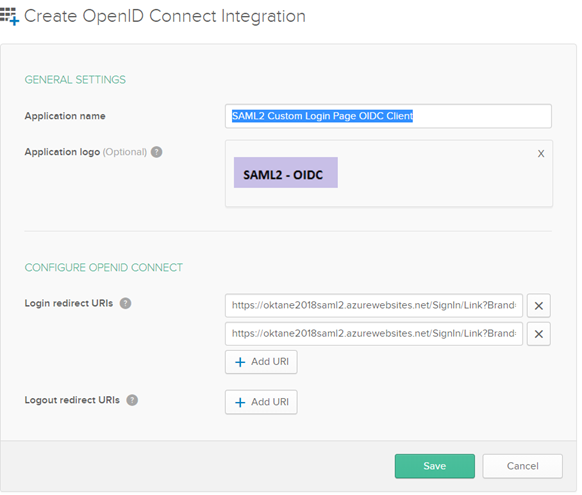
	 
	* Allowed Grant Type: [checked]Authorization Code
	 
	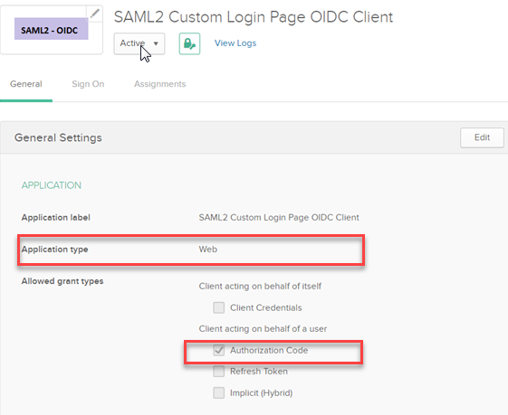
	 
	 
	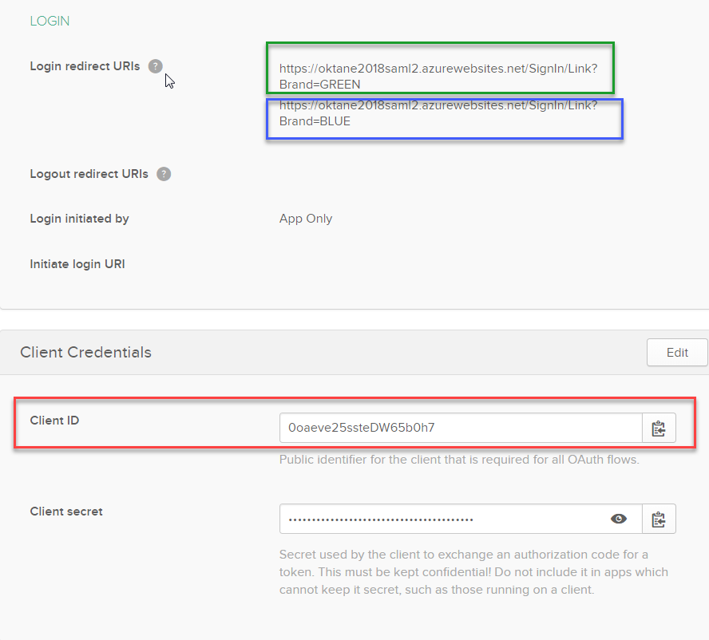
	 
	* This **client ID** in client credentials section will be used in every SAML2 application configuration. 
	* Assign this application to Everyone group. Because this application will be a common Proxy application for all SAML applications
	 
	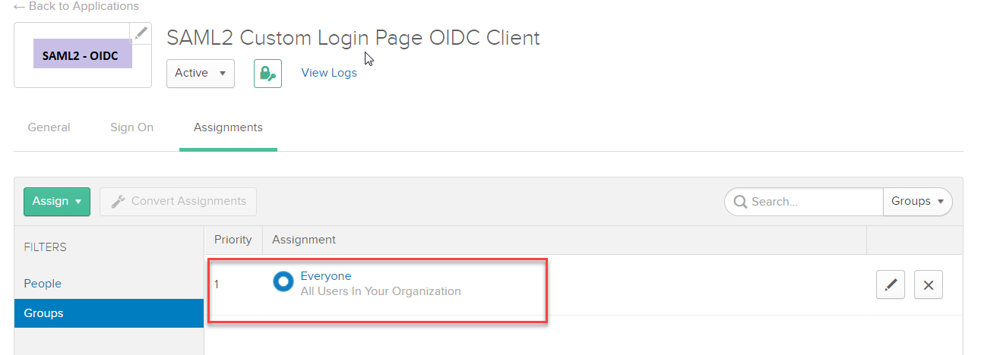
	  

### 6.3 Configure SAML 2.0 Green Brand Application ###
For SAML branded application, we will have to create separate configuration for each brand. Now, we will add SAML 2.0 Green Brand application.

- Click on **Add Application** button
	 
	
	 	
- Click on **Create New App** button
	 
	
	 
- New Application Integration
	
	* Platform: Web
	* Sign on Method: SAML 2.0
	 
	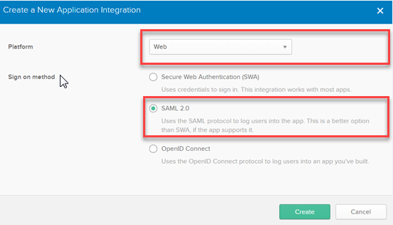
	  
- SAML Integration
	* Provide App Name: SAML2 Green WebApp
	 
	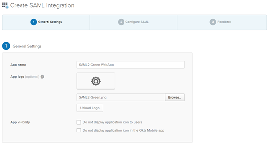
	 

- SAML Settings:
	* Single Sign On URL: Provide Sign On URL e.g. https://oktane2018saml2.azurewebsites.net/Saml2/Acs
	* Recipient URL: Same as Sign On URL
	* Destination URL: Same as Sign On URL
	* Audience Restriction: e.g. https://www.oktane2018.com/okta.clients.SAML2
	* Name ID Format: Unspecified
	* Response: Signed
	* Assertion Signature: Signed
	 
	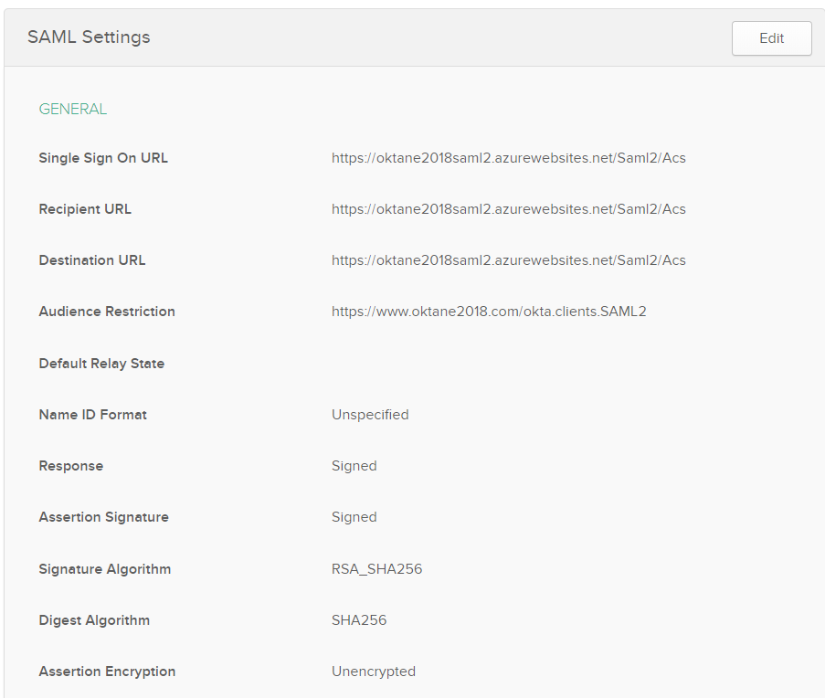
	 
- SAML Logout Setting: click on Show Advance Settings and Provide Single Logout URL and Certificate
	* SAML Single Logout: Enabled 
	* Signle Logout URL: e.g. https://oktane2018saml2.azurewebsites.net/
	* SP Issuer: Provide issuer e.g. https://www.oktane2018.com/okta.clients.SAML2
	* Signature Certificate: Upload certificate file
	 
	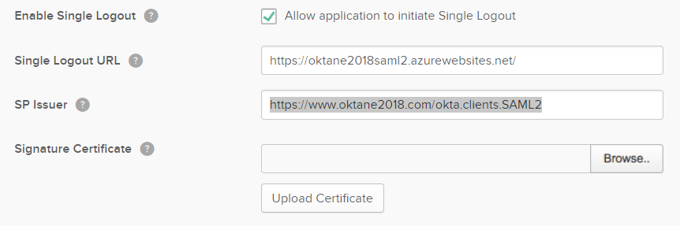
	 
- SAML Attributes: Provide attributes that will be available in SAML response
	* uid
		* Name: uid
		* Name format: Unspecified
		* Value: user.id
	* orgid
		* Name: orgid
		* Name format: Basic
		* Value: value of OrgId e.g. 00oen1q08omzCcwsC0h7
	* brand
		* Name: brand
		* Name format: Basic
		* Value: GREEN
	* name
		* Name: name
		* Name format: Unspecified
		* Value: user.displayName
	* firstName
		* Name: http://schemas.xmlsoap.org/ws/2005/05/identity/claims/givenname
		* Name format: Unspecified
		* Value: user.firstName
	* lastName
		* Name: http://schemas.xmlsoap.org/ws/2005/05/identity/claims/surname
		* Name format: Unspecified
		* Value: user.lastName
	* login
		* Name: login
		* Name format: Unspecified
		* Value: user.login
	* email
	 	* Name: email
	 	* Name format: Unspecified
	 	* Value: user.email
	 
	
	 
- Feedback:
	 
	
	 
- Configure Login Page URL: Provide Login Page URL for Green Brand SAML Application. This link will include: 

	* **Authorize Endpoint**: Login page URL is the authorize endpoint of the custom Okta authorization server e.g. https://dev-217355.oktapreview.com/oauth2/auseqf1tfe6bvmQpP0h7/v1/authorize
	* **client_id**: It is the Client ID for **SAML2 Custom Login Page OIDC Client**. 
	* **redirect_uri** : It is the endpoint for SAML2 application that will issue Sign-in request. This URL must be defined as on of the valid **Login redirect URIs** in the Proxy app. 
	* **idp**: It is Identity Provider Assertion Consumer Service URL idp value    
	* For other query string parameter, see image below:
     
	
	 
- Assign group to application: Assign GreenBrand Group
	 
	
	 
### 6.4 Configure SAML 2.0 Blue Brand Application ###
For SAML branded application, we will have to create separate configuration for each brand. Now, we will add SAML 2.0 Blue Brand application.

- Click on **Add Application** button
	 
	
	 	
- Click on **Create New App** button
	 
	
	 
- New Application Integration:
	
	* Platform: Web
	* Sign on Method: SAML 2.0
	 
	
	  
- SAML Integration:
	* Provide App Name: SAML2 Blue WebApp
	 
	
	 

- SAML Settings:
	* Single Sign On URL: Provide Sign On URL e.g. https://oktane2018saml2.azurewebsites.net/Saml2/Acs
	* Recipient URL: Same as Sign On URL
	* Destination URL: Same as Sign On URL
	* Audience Restriction: e.g. https://www.oktane2018.com/okta.clients.SAML2
	* Name ID Format: Unspecified
	* Response: Signed
	* Assertion Signature: Signed
	 
	
	 
- SAML Logout Setting: click on Show Advance Settings and Provide Single Logout URL and Certificate
	* SAML Single Logout: Enabled 
	* Signle Logout URL: e.g. https://oktane2018saml2.azurewebsites.net/
	* SP Issuer: Provide issuer e.g. https://www.oktane2018.com/okta.clients.SAML2
	* Signature Certificate: Upload certificate file
	 
	
	 
- SAML Attributes: Provide attributes that will be available in SAML response
	* uid
		* Name: uid
		* Name format: Unspecified
		* Value: user.id
	* orgid
		* Name: orgid
		* Name format: Basic
		* Value: value of OrgId e.g. 00oen1q08omzCcwsC0h7
	* brand
		* Name: brand
		* Name format: Basic
		* Value: BLUE
	* name
		* Name: name
		* Name format: Unspecified
		* Value: user.displayName
	* firstName
		* Name: http://schemas.xmlsoap.org/ws/2005/05/identity/claims/givenname
		* Name format: Unspecified
		* Value: user.firstName
	* lastName
		* Name: http://schemas.xmlsoap.org/ws/2005/05/identity/claims/surname
		* Name format: Unspecified
		* Value: user.lastName
	* login
		* Name: login
		* Name format: Unspecified
		* Value: user.login
	* email
	 	* Name: email
	 	* Name format: Unspecified
	 	* Value: user.email
	 
	
	 
- Feedback:
	 
	
	 
- Configure Login Page URL: Provide Login Page URL for Blue Brand SAML Application. This link will include:
	* **Authorize Endpoint**: Login page URL is the authorize endpoint of the custom Okta authorization server e.g. https://dev-217355.oktapreview.com/oauth2/auseqf1tfe6bvmQpP0h7/v1/authorize
	* **client_id**: It is the Client ID for **SAML2 Custom Login Page OIDC Client**. 
	* **redirect_uri** : It is the endpoint for SAML2 application that will issue Sign-in request. This URL must be defined as on of the valid **Login redirect URIs** in the Proxy app. 
	* **idp**: It is Identity Provider Assertion Consumer Service URL idp value
	* For other query string parameter, see image below:    
	 
	 
	
	 
	 
- Assign group to application: Assign BlueBrand Group
	 
	
	 

### 6.5 Configure SAML 2.0 Okta Application ###
For SAML branded application, we will have to create separate configuration for each brand. Now, we will add SAML 2.0 Okta application that will show default Okta login page.
This application will not use any of the custom login pages. 

- Click on **Add Application** button
	 
	
	 	
- Click on **Create New App** button
	 
	
	 
- New Application Integration:
	
	* Platform: Web
	* Sign on Method: SAML 2.0
	 
	
	  
- SAML Integration:
	* Provide App Name: SAML2 Blue WebApp
	 
	
	 

- SAML Settings:
	* Single Sign On URL: Provide Sign On URL e.g. https://oktane2018saml2.azurewebsites.net/Saml2/Acs
	* Recipient URL: Same as Sign On URL
	* Destination URL: Same as Sign On URL
	* Audience Restriction: e.g. https://www.oktane2018.com/okta.clients.SAML2
	* Name ID Format: Unspecified
	* Response: Signed
	* Assertion Signature: Signed
	 
	
	 
- SAML Logout Settings: click on Show Advance Settings and Provide Single Logout URL and Certificate
	* SAML Single Logout: Enabled 
	* Signle Logout URL: e.g. https://oktane2018saml2.azurewebsites.net/
	* SP Issuer: Provide issuer e.g. https://www.oktane2018.com/okta.clients.SAML2
	* Signature Certificate: Upload certificate file
	 
	
	 
- SAML Attributes: Provide attributes that will be available in SAML response
	* uid
		* Name: uid
		* Name format: Unspecified
		* Value: user.id
	* orgid
		* Name: orgid
		* Name format: Basic
		* Value: value of Okta OrgId e.g. 00oen1q08omzCcw####
	* brand
		* Name: brand
		* Name format: Basic
		* Value: OKTA
	* name
		* Name: name
		* Name format: Unspecified
		* Value: user.displayName
	* firstName
		* Name: http://schemas.xmlsoap.org/ws/2005/05/identity/claims/givenname
		* Name format: Unspecified
		* Value: user.firstName
	* lastName
		* Name: http://schemas.xmlsoap.org/ws/2005/05/identity/claims/surname
		* Name format: Unspecified
		* Value: user.lastName
	* login
		* Name: login
		* Name format: Unspecified
		* Value: user.login
	* email
	 	* Name: email
	 	* Name format: Unspecified
	 	* Value: user.email
	 
	
	 
- Feedback:
	 
	
	 
- Configure Login Page URL: Use the default organization login page
	 
	
	 
- Assign group to application: Assign both GreenBrand Group and BlueBrand Group
	 
	
	 

 
[<a href="#top">Back to Top</a>]
 

# E. Configure, Deploy and Run Web Applications

Now, we will update/review configuration settings for each project based on our Okta's Sandbox settings. It will give us better understanding of configuring Multi-branded application against single Okta Org. After that we should be able to publish/run on Microsoft Azure or run projects locally.

1. **OktaLogin**: First we will update configuration settings for OktaLogin project and run it locally or publish on Microsoft Azure.

	* **Note:** The key take away is that Relay state that is posted to the Login page will be returned in the response as the redirect URL. After authentication, the Okta session cookie is set there by allowing single sign-on between applications. 
	* Update **appSettings** section in **Web.config**
		* ida:Authority: Provide Okta's Preview Sandbox e.g. e.g. https://dev-######.oktapreview.com
		 
		
		 
	* Review **SignInController.cs** 
		* Read Okta RelayState parameter (Form POST parameter)
		* Read Brand Code from URL hostname or from query string parameter
		 
		
		 
	* Review **login_util.js** under **Scripts**
		* Check how values for redirectUrl and orgUrl are provided to Okta's Sign-In widget
		 
		
		  
	* [Optional] **Publish Okta Login on Microsoft Azure**	
		* You can publish Okta Login project on Azure and host login pages on branded domains e.g. https://demo.login.greenbrand.com and https://demo.login.bluebrand.com
		 
		
		 
	* [optional] ** Custom Domains configuration in Microsoft Azure**
		* You can configure custom domains for login page application in Microsoft Azure
		 
		
		  
	* <b>Note</b>:This application must be running (either in Azure or locally) before you test OpenID Client application or SAML 2.0 Client application
	 

2. **Okta.Clients.OpenIdConnect**: Lets update/review configuration settings for OpenID Connect client application.
	* Update **appSettings** section in **Web.config**
		* ida:Authority: Provide Okta's Preview Sandbox environment e.g. https://dev-######.oktapreview.com
		* ida:AuthorizationServer: Provide Custom Authorization server e.g. https://dev-######.oktapreview.com/oauth2/auseqf1tfe6bvxxxxxxx
		* ida:ClientId: Provide Client ID for this application
		* ida:ClientSecret: Provide Client secret for this application
		* ida:RedirectUri: Provide Redirect URL after user authentication e.g. https://hostname.com/
		* idp:BlueBrand: Provide Identity Provider (IdP) value for Blue brand
		* idp:GreenBrand: Provide Identity Provider (IdP) value for Green brand
		 
		
		 
	* Review **IdentityProviderManagement.cs** utility class 
		* This purpose of this utility class is to determine application brand based on hostname or brand query string parameter.
		* If application is hosted on branded domain names e.g. app1.greenbrand.com and app1.bluebrand.com then this class can dynamically determine brand based on hostname.
		* If application is not hosted on branded domain names then brand can be passed as query string parameter e.g. app1.azurewebsites.net?brand=green or app1.azurewebsites.net?brand=blue
		 
		
		 		
	* Review OpenID Connect Notification handler defined in **Startup.Auth.cs** under **App_Start**
		 * Review OnRedirectToIdentityProvider Notfication handler. We have to switch IdP value based on selected brand. Normally, brand will be determined based on hostname of application. For Example: app1.greenbrand.com means brand is green then we have to pass green brand IdP value to Okta's authorization server
		  
		 
		  
	* Make sure OktaLogin project is running
	* Run OpenID Connect client application for Okta Brand
		* Start application
			 
		 	
		 	 
		* Select Okta brand and click Sign-In button. You will see login page for Okta brand (default login).
			 
		 	
		 	 
		* Enter credentials for test account e.g. john.doe@bluebrand.com and login. You will see user profile page.
			 
		 	
		 	 
		* Sign-out
	* Run OpenID Connect client application for Blue Brand
		* Start application
			 
		 	
		 	 
		* Select Blue brand and click Sign-In button. You will see login page for blue brand.
			 
		 	
		 	 
		* Enter credentials for test account e.g. john.doe@bluebrand.com and login. You will see user profile page.
			 
		 	
		 	 
		* Sign-out
	* Run OpenID Connect client application for Green Brand
		* Start application
			 
		 	
		 	 
		* Select Green brand and click Sign-In button. You will see login page for Green brand.
			 
		 	
		 	 
		* Enter credentials for test account e.g. John.Doe@greenbrand.com and login. You will see user profile page.
			 
		 	
		 	 
		* Sign-out

3. **Okta.Clients.SAML2**: For SAML 2.0 client application, update configurations based on your Okta's sandbox environment and run the application. Make sure Login page application is already running.
	
	* Update **appSettings** section in **Web.config**
		* idp:BlueBrand: Identity Provider issuer ID for Blue brand. Each brand must be configured as separate application.
		* idp:GreenBrand: Identity Provider issuer ID for Green brand. Each brand must be configured as separate application.
		* idp:OktaBrand: Identity Provier issuer ID for default Okta brand. Each brand must be configured as separate application.
		* sustainsys.saml2 entityId: Audience URI
		* sustainsys.saml2 returnUrl: SAML2 response will be sent here
		* sustainsys.saml2 identityProviders entityId: Okta Identity Provider Issuer
		* sustainsys.saml2 identityProviders metadataLocation: Metadata URL for SAML2 Identity Provider
		 
		
		 
		 
		
		 
		Get SAML configuration information from Okta (SAML2 Web App --> Sign On)
		 
		
		 
	* Review SAML2 Notification handler defined in **Startup.Auth.cs** under **App_Start**
		 * Review SAML2 Notfication handler. We have to switch IdP value based on selected brand. 
		  
		 
		  
	* Make sure OktaLogin project is running
	* Run SAML2 client application for Okta Brand
		* Start application
			 
		 	
		 	 
		* Select Okta brand and click Sign-In button. You will see login page for default Okta brand.
			 
		 	
		 	 
		* Enter credentials for test account e.g. john.doe@bluebrand.com and login. You will see user profile page.
			 
		 	
		 	 
		* Sign-out
	* Run SAML2 client application for Blue brand
		* Start application
			 
		 	
		 	 
		* Select Blue brand and click Sign-In button. You will see login page for blue brand.
			 
		 	
		 	 
		* Enter credentials for test account e.g. jane.doe@bluebrand.com and login. You will see user profile page.
			 
		 	
		 	 
		* Sign-out
	* Run SAML2 client application for Green brand
		* Start application
			 
		 	
		 	 
		* Select Green brand and click Sign-In button. You will see login page for green brand.
			 
		 	
		 	 
		* Enter credentials for test account e.g. john.doe@greenbrand.com and login. You will see user profile page.
			 
		 	
		 	 
		* Sign-out
 
[<a href="#top">Back to Top</a>]
 
